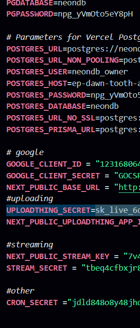

first use the `npm i` commend and set env file like

for db use prisma and for the uploding use uplodingthing and for the chat stream use stream and for the google auth use the google clude and 

set other enve variable using randam key 

`npm run dev` for running both client and serverr  at local host 3000
`npx prisma studio` use for manage the db at localhost 5555

///

step1-> project and run `npm i --legacy-peer-deps`.
step2-> setup your price account and add a env file 
step3 -> run commend for start `npm run dev`
step4 -> run your db in other terminal `npx prisma studio`

got the the link [http://localhost:3001/signup]
[http://localhost:3001/login]

for db management go to the [http://localhost:5556/]

and for again sinup delete the session cookie 

 step-1 --> download clone full code 
 
 first run this commend `npm i --legacy-peer-deps`.

 step 2-> create a accunt on prisma and use db chage your env file 

 step3 -> for running frontend and backend use commend `npm run dev`
 [http://localhost:3000]
 stpe4 --> for seeing yout db run one other comment  `npx prisma studio`  
 can be see your db at [http://localhost:5555]
 
